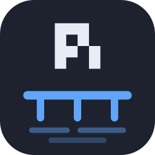
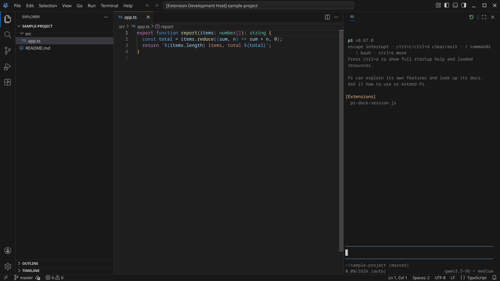
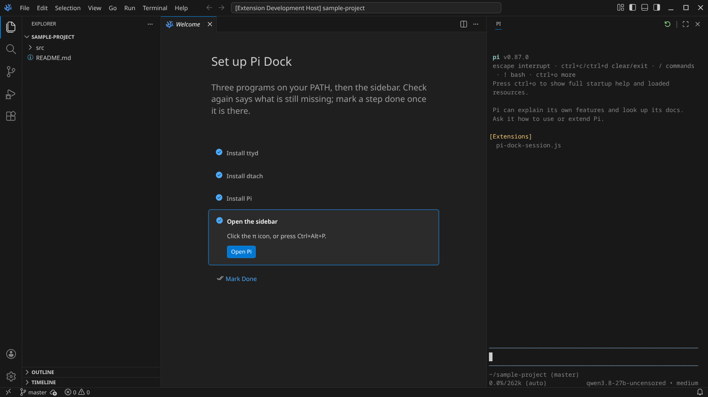

<h1 align="center">Pi Dock</h1>

The real Pi, docked in your sidebar.

  
  
  
  
  

Pi Dock puts the real Pi terminal in a panel beside the editor, scoped to the open folder, keeping
every existing configuration. It follows esisting themes, responds to familiar keys, and retains its session across launches.

## Features

### Pi Docked

Docked in the sidebar, Pi runs in the workspace folder and uses the same configuration as the VS Code terminal.

### Session Resume

Close the workspace and reopen it, and Pi resumes exactly where it left off. Move the
sidebar and the session keeps running.

The command palette (`Ctrl+Shift+P`) offers three commands:

- **Resume Session…** lists every conversation in this folder, newest first.
- **New Session** starts clean.
- **Fork Session…** branches off a copy.

### Resizable

The sidebar can be changed to any size and Pi will resize to fit.

### Native Terminal Behaviour

- **Ctrl+click a path** in Pi's answer, like `src/app.ts` or `src/app.ts:12`, and the file opens.

### Native Terminal Theming

Colours and fonts come from your VS Code theme and terminal settings, and follow when you change
them. Background color is sourced from the sidebar background color set in the VS Code theme. All other colors come from the VS Code terminal and Pi settings.

### Keyboard Focus
While Pi Dock has focus every key goes to Pi, except the few VS Code needs, like the command
palette. Which ones is a setting.

### Panel Included

**Terminal ▸ New Terminal** offers a **Pi** profile: the same Pi, in VS Code's own terminal at the
bottom.

## Durable Design

Pi runs as the real program in a real terminal, and the sidebar draws it with the same engine VS
Code uses for its own terminal. Nothing here parses Pi's output or relies on how it is built, and
the editor side is a plain webview on VS Code's stable extension API. A new Pi or a new VS Code
changes nothing. The only hook into Pi is a small extension on its public API that remembers
which conversation to resume.

## Install
1. Get the `.vsix`:
   - Use the download button on the [Open VSX](https://open-vsx.org/extension/BenJGadd/pi-dock) page.
   - Download directly from [GitHub releases](https://github.com/BenJGadd/pi-dock/releases).
2. Install in VS Code: **Extensions** ▸ **`…`** ▸ **Install from VSIX**.

3. In VS Code: **Help ▸ Welcome ▸ Set up Pi Dock** 
    - The extension has a built-in guide for installing the requirements (ttyd & dtach) and toggling the Pi Dock:

## Settings

Everything works with no settings at all. If you want to change something:

- `piDock.command` — what to run. `["pi"]` unless you say otherwise.
- `piDock.resume` — pick up the last conversation at each start. On.
- `piDock.persist` — keep Pi alive when the sidebar moves. On.
- `piDock.fontSize`, `piDock.fontFamily`, `piDock.theme` — a different look for the terminal.
- `piDock.escapeActions` — the VS Code commands whose keys should not go to Pi.
- `piDock.ttydPath`, `piDock.dtachPath`, `piDock.extraArgs` — where the two helpers are, and
  extra arguments for ttyd.

## More

[docs/DETAILS.md](docs/DETAILS.md) has the rest: how it works, every key, remote windows,
security, the layout of the code, and how the pictures above were taken.
